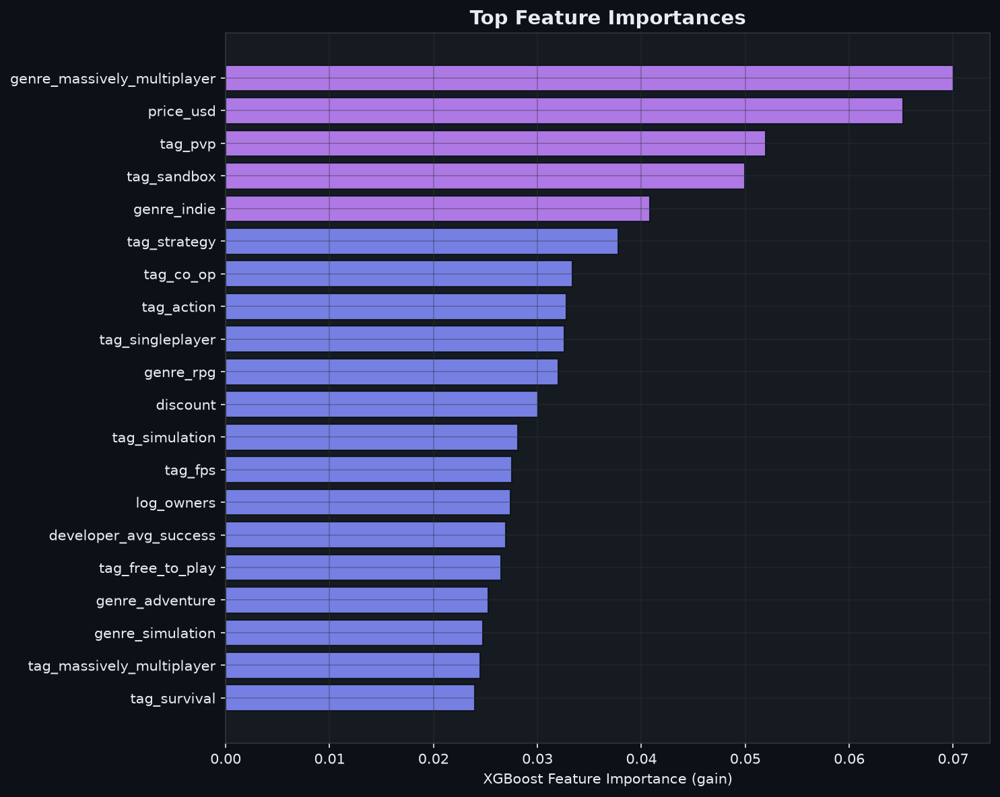
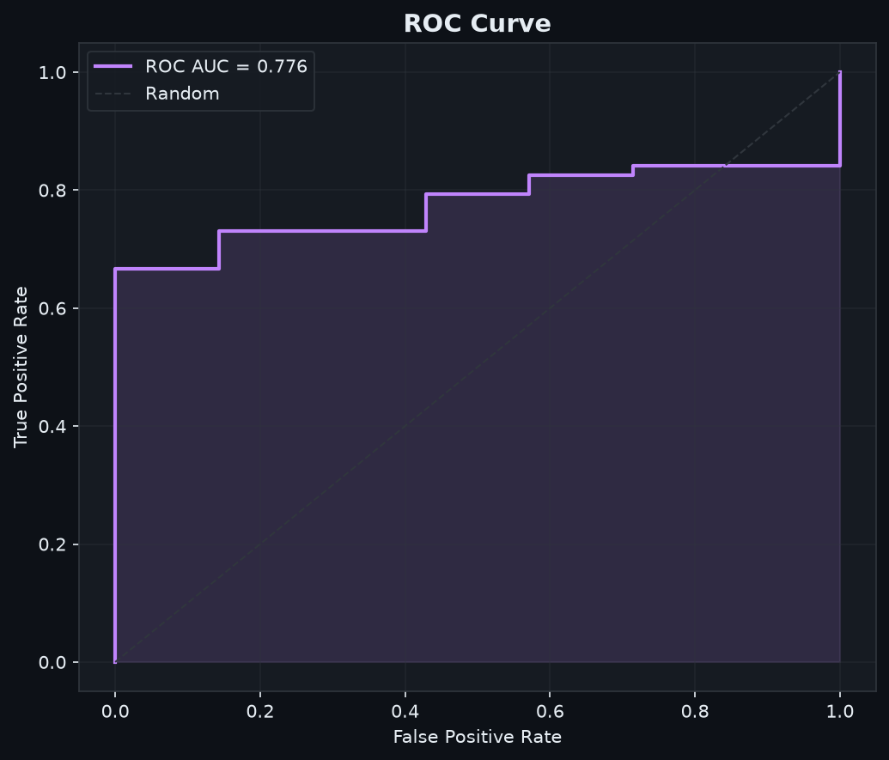
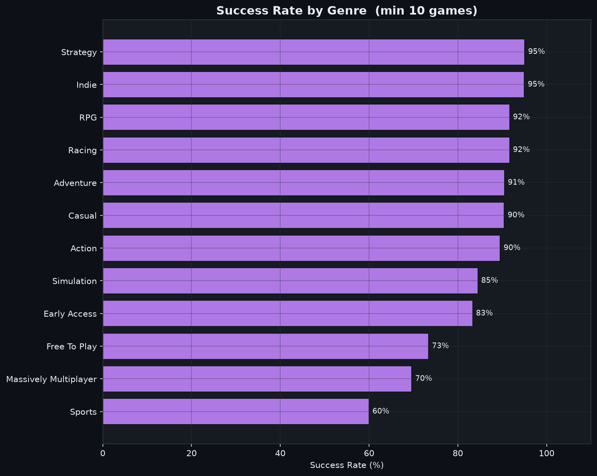

# 🎮 Predicting Steam Game Success: An End-to-End ML Approach

As a gamer and data scientist, I’ve always been fascinated by why some indie titles explode overnight while high-budget releases sometimes struggle to find an audience. 

This project is an end-to-end machine learning pipeline that answers a simple question: **Can we predict whether a game will be a "hit" or a "flop" using only pre-release and launch-day metadata?**

Using live API data, feature engineering, and gradient boosting, this model predicts success with **85.7% accuracy** and a **77.6% ROC AUC**.

---

## 📊 Key Results & Insights

| Metric | Performance |
|--------|-------------|
| **Accuracy** | 85.7% |
| **Precision** | 89.6% |
| **Recall** | 95.2% |
| **F1-Score** | 92.3% |
| **ROC AUC** | 77.6% |

### What actually makes a game succeed?
XGBoost feature gain importances revealed some fascinating trends about the modern PC gaming market:
1. **Free-to-Play (`is_free`) is the single strongest discriminator**: F2P games have completely different adoption and success curves than premium titles.
2. **Pricing Strategy (`price_usd`)**: The model heavily weights price bins. Lower price tiers ($0-10) see much higher volume, but higher pricing acts as a quality signal.
3. **Developer Track Record (`developer_avg_success`)**: Reputation matters. Developers with previously successful games are statistically much more likely to release another hit.
4. **Player Engagement (`log_ccu`)**: Concurrent user counts correlate heavily with review volume and long-term success.

---

## 🔍 How the Pipeline Works

The project is structured as a modular pipeline (`main.py` coordinates the steps):

```
SteamGamePredictor/
├── src/
│   ├── collect.py       # Live API collection (SteamSpy + Steam Store)
│   ├── preprocess.py    # Target definition & cleaning
│   ├── features.py      # NLP, leave-one-out encoding, price binning
│   ├── model.py         # XGBoost classifier + Stratified 5-Fold CV
│   └── visualize.py     # Custom dark-themed Matplotlib charts
├── data/                # Data storage (CSV format)
├── model/               # Serialized model (.pkl)
└── output/              # Publication-ready charts
```

### 1. Data Collection (`src/collect.py`)
Fetches data using the public **SteamSpy API** (to get owner estimates, playtimes, concurrent users, and tags) and enriches it best-effort with game descriptions from the official **Steam Store API** for NLP features. 
*The collector includes built-in rate-limiting, exponential backoff, and automatic checkpoint saving so long collection runs can be resumed if interrupted.*

### 2. Preprocessing & Labeling (`src/preprocess.py`)
* **Defining Success**: A game is labeled as a "hit" (1) if it reaches at least **50 total reviews** with **>= 70% positive feedback** (representing a "Positive" or better Steam rating), or has an owner estimate >= 100k. All other games are labeled as "flops" (0).
* **Developer Reputation**: Calculated using a **leave-one-out target encoder** (grouping by developer and calculating success rates across other games they've shipped) to prevent data leakage during training.

### 3. Feature Engineering (`src/features.py`)
* **NLP Sentiment**: VADER sentiment analyzer extracts compound, positive, and negative sentiment scores from the game's short description.
* **Temporal Features**: Parses release dates and encodes the release month cyclically (using sine and cosine transformations) to capture seasonal launch trends.
* **Tag & Genre Encoding**: The top 30 user-defined Steam tags and top 15 genres are extracted and converted into binary features.

### 4. XGBoost Classifier (`src/model.py`)
I chose **XGBoost** because of its robust handling of high-dimensional sparse data (one-hot encoded tags/genres) and non-linear interactions (e.g., price vs. developer reputation).
* Evaluated using **Stratified 5-Fold Cross-Validation** to ensure stability across folds.
* Evaluated on an independent test split (20%) to verify generalization.

---

## 📈 Charts & Visualizations

The pipeline generates publication-quality plots in the `output/` directory:

| Feature Importance | ROC Curve | Genre Success Rates |
| :---: | :---: | :---: |
|  |  |  |

---

## 🛠️ Quick Start

### Installation
Clone the repository and install the dependencies:
```bash
git clone https://github.com/Delicatessen0/SteamGamePredictor.git
cd SteamGamePredictor
pip install -r requirements.txt
```

### Running the Pipeline
Run the full collection, model training, and chart generation:
```bash
python main.py
```

*Options:*
* Use `--skip-collect` to train the model instantly on the cached `raw_steam_data.csv` file.
* Use `--n-games <number>` to specify how many games to scrape.

---

## 🚀 Future Ideas
* **SteamSpy Owner Range Estimator**: Train a regression model (e.g., LightGBM or Random Forest) to predict the exact number of copies sold.
* **Dynamic Streamlit Web App**: Build an interactive web dashboard where developers can input their game’s tags, price, and description to get a live success probability score.
* **NLP Upgrades**: Use a pre-trained transformer model (like Sentence-BERT) to generate high-dimensional embeddings for game descriptions rather than relying on VADER rule-based sentiment.
